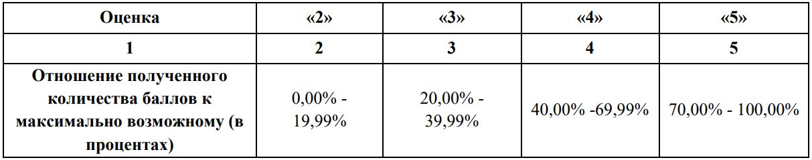

https://esat.worldskills.ru/competencies/dac59f20-134b-4aa4-94e5-518c488ccc9e/categories/d747aed4-5204-4ab4-a3f1-dec61f99735d

https://docs.google.com/document/d/17dkgRFIxEAdOvFsUuCD5TGeWHCqcC7U-Ha5MJ0EfdtI/edit#

UML - диаграмма (Как работает программа)

ER - модель (БД ее структура)

Импорт из Exel .ctv .txt в БД

Библиотека классов и Unit Test

Документирование ПО

Разработка desktop-приложений:
Режим администратора или Авторизация
Макет отображения Вывод данных и закрашивание ячеек
1. Плитка
2. Список 
3. Мультибиндинг 
4. Покрасить в светло-зеленый 
5. Зачеркнуть товар без скидки, посчитать ее и в одну строку вывести

Реагирует на движение мыши ?
Панель навигации
Поиск
Фильтрация
Отображение записей
Удаление

1. Возможность развития информационной системы другими разработчиками.
2. Соответствие руководству по стилю заказчика
3. Обратная связь системы с пользователем
4. Стабильная работа всех разработанных программ
5. Стиль кода на протяжении разработки всей системы
6. Организация файловой структуры проекта
7. Соблюдение культуры кодирования
8. Комментарии к коду
9. Умение работать с системой контроля версий.
10. Умение работать с readme.md

http://192.168.1.20:3000

База данных для MsSQL

* БД - 192.168.1.20
* БД name - 195bv
* LOGIN - 195bv 
* PASS - 12345